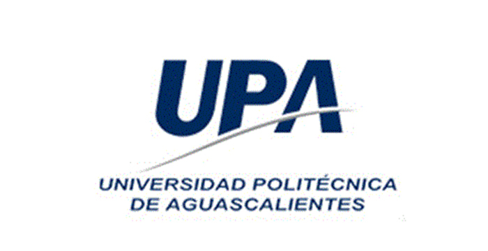
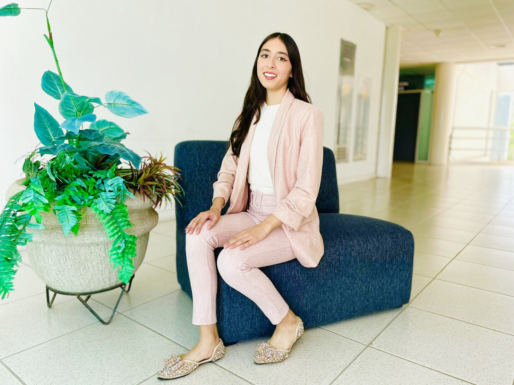

<h1> Subject: Programming </h1>

<p><em>Polytechnic University of Aguascalientes</em></p>
<p><em>Computational Systems Engineering</em></p>
<p><em>School cycle &mdash; Sep 2022 / Dec 2022</em></p>
<br />
<p></p>
<br />

<h2>General Information</h2>
<br>

<ul>
<li>Student: Danna Janeth Sanchez Carreón</li>
<li>ID: UP210508</li>
<li>Professor: Luis Ernesto Anaya Tiscareño</li>
<li>Grade: ISC03B</li>
</ul>
<br />

<h2>README per unit</h2>
<br>

<ol>
<li><a href="https://github.com/UP210508/UP210508_cpp/blob/main/U1/README.md">Unit 1 &mdash; Programming Introduction</a></li>
<li><a href="https://github.com/UP210508/UP210508_cpp/blob/main/U2/README.md">Unit 2 &mdash; Control Structures and cycles</a></li>
<li><a href="https://github.com/UP210508/UP210508_cpp/tree/main/U3">Unit 3 &mdash; Functions</a></li>
<li><a href="https://github.com/UP210508/UP210508_cpp/blob/main/U4/README.md">Unit 4 &mdash; Files and arrays</a></li>
</ol>
<br />

<h2>To clone this repository</h2>
<br />

```
git clone https://github.com/UP210508/UP210508_cpp
```

<h2>About me</h2>
<br />

<p>¡Hello world! My name is <strong>Danna Carreón</strong>. I am a neophyte in the world of programming. However, I am willing to learn new things and I am aware how hard it is to learn a programming language for the first time, that is why I want to share with you how little or much I learn with this wonderful technology such as C++. </p>
<br />

<p>It is said that we learn more when we share what we know. Please feel free to comment on my code, give me some recommendation or star-pin something you find interesting. I will be attentive to advice and with the best arrangement to help.</p>
<br />

<p><cite>&mdash; Danna Carreón</cite></p>
<br />


<br />
