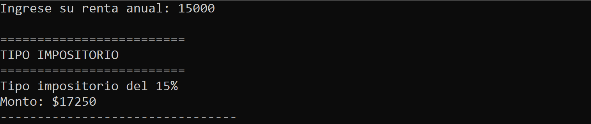
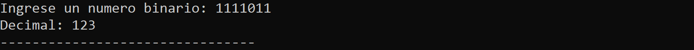

<link rel="stylesheet" href="../styles.css" />

<h1>This is Unit 2: Control Structures and cycles</h1>

<section>
<p>This file contains information about every single file that you can find at this folder. These files are the result of a learning process, so as you advance to the next file you will find programs with a higher degree of difficulty.</p>
</section>

<section>
<h2>What are control structures?</h2>
<br>

<p>Control Structures are just a way to specify flow of control in programs. Any algorithm or program can be more clear and understood if they use self-contained modules called as logic or control structures. It basically analyzes and chooses in which direction a program flows based on certain parameters or conditions. There are three basic types of logic, or flow of control, known as:
</p>

<ul>
    <li>Sequence logic, or sequential flow</li>
    <li>Selection logic, or conditional flow</li>
    <li>Iteration logic, or repetitive flow</li>
</ul>
</section>

<section>
<h2>Content</h2>
<br>

<ol>
<li><a href="#rent">Exercise &mdash; Renta.cpp</a></li>
<li><a href="#performance">Exercise &mdash; Rendimiento.cpp</a></li>
<li><a href="#age">Exercise &mdash; EdadDelCliente.cpp</a></li>
<li><a href="#ingredients">Exercise &mdash; Ingredientes.cpp</a></li>
<li><a href="#temperatures">Exercise &mdash; Temperature.cpp</a></li>
<li><a href="#products">Exercise &mdash; Productos.cpp</a></li>
<li><a href="#binToDec">Exercise &mdash; BinToDec.cpp</a></li>
<li><a href="#table">Exercise &mdash; TablaMulti.cpp</a></li>
<li><a href="#biseccion">Exercise &mdash; Bifurcacion.cpp</a></li>
</ol>
</section>

<main>
<section id="rent">
<h2>Exercise 1 &mdash; Renta.cpp</h2>
<br>

<a href="#">Return</a>

<p>This is a program that asks for annual rent user to calculate a tax rate. It uses nasted if/else statements to choose the corresponding depository.</p>
<br>

<h3>C++ Preprocessor directives</h3>

```
#include <iostream>;
```
<br>

<h3>Variable declarations</h3>

```
double renta;
double impositorio;
```
<br>

<h3>Input user</h3>

```
cout<<"Ingrese su renta anual: ";
cin>>renta;
```
<br>

<h3>Processing</h3>

```
cout<<"\n=========================\n";
cout<<"TIPO IMPOSITORIO\n";
cout<<"=========================\n";

if ( renta < 10000 ) {
      cout<<"Tipo impositorio del 5%\n";
      impositorio = 1.05;
} else if ( renta >= 10000 && renta <= 20000 ) {
      cout<<"Tipo impositorio del 15%\n";
      impositorio = 1.15;
} else if ( renta > 20000 && renta <= 35000 ) {
      cout<<"Tipo impositorio del 20%\n";
      impositorio = 1.20;
} else if ( renta > 35000 && renta <= 60000 ) {
      cout<<"Tipo impositorio del 30%\n";
      impositorio = 1.30;
} else if ( renta > 60000 ) {
      cout<<"Tipo impositorio del 45%\n";
      impositorio = 1.45;
}
```
<br>

<h3>Output for user</h3>

```
cout<<"Monto: $"<<renta * impositorio;
```
<br>

<h3>Explanation</h3>
<br>

<ol>
<li>Declarate two variables called "renta" and "impositorio" data type "double".</li>
<li>Ask the user for the annual rent.</li>
<li>Show heading to the user.</li>
<li>If rent is minor than $10,000 "impositorio" variable is 1.05 and go step 5. But if not: 
      <ol>
            <li>Check if rent is greater or equal than $10,000 and rent is minor or equal than $20,000, "impositorio" variable is 1.15 and go step 5. But if not.</li>
            <li>Check If rent is greater than $20,000 and rent is minor than $35,000, "impositorio" variable is 1.20 and go step 5. But if not.</li>
            <li>Check If rent is greater than $35,000 and rent is minor than $60,000, "impositorio" variable is 1.30 and go step 5. But if not</li>
            <li>It means that the rent is greater than $60,000 and therefore "impositorio" variables is 1.45 and go step 5.</li>
      </ol>
</li>
<li>Calculate the tax rate multiplying "renta" with "impositorio".</li> 
<li>Show the result to the user.</li>
</ol>
<br>

<h3>Screenshots</h3>
<br>

<p>Rent minor than $10,000</p>

<br>
<br>

<p>Rent greater or equal than $10,000 and minor or equal than $20,000</p>

<br>
<br>

<p>Rent greater or equal than $20,000 and minor or equal than $35,000</p>

<br>
<br>

<p>Rent greater or equal than $35,000 and minor or equal than $60,000</p>

<br>
<br>

<p>Rent grater than $60,000</p>

<br>
<br>
</section>

<section id="performance">
<h2>Exercise 2 &mdash; Rendimiento.cpp</h2>
<br>

<a href="#">Return</a>

<p>The current programm recieves a user score that is the result of his/her performance at a company, with this score the programm gives a bonification to this user and determines a performing category to him/her.</p>
<br>

<h3>C++ Preprocessor directives</h3>

```
#include <iostream>;
```
<br>

<h3>Variable declarations</h3>

```
double score;
```
<br>

<h3>Input user</h3>

```
cout<<"Ingrese su puntuacion: ";
cin>>score;
```
<br>

<h3>Processing</h3>

```
// Show to user the options 
cout<<"\n************** POSIBLES PUNTUACIONES ****************\n";
cout<<"\t0.0\n";
cout<<"\t0.4\n";
cout<<"\t0.6 o mas\n";
cout<<"*****************************************************\n";

// Validate what user enters
while( score < 0 || ( score > 0 && score < 0.4) || (score > 0.4 && score < 0.6) ) {
      cout<<"\nPuntuacion no valida\n";
      cout<<"Ingrese su puntuacion: ";
      cin>>score;
}
            
// Show perfomance level
cout<<"\n====================\n";
cout<<"NIVEL DE RENDMIENTO\n";
cout<<"====================\n\n";
            
if ( score == 0.0 ) {
      cout<<"Inaceptable\n";
} else if ( score == 0.4 ){
      cout<<"Aceptable\n";
} else if ( score >= 0.6 ) {
      cout<<"Meritorio\n";
}
```
<br>

<h3>Output for user</h3>

```
cout<<"Dinero a recibir: "<<score * 2400<<endl;
```
<br>

<h3>Explanation</h3>
<br>

<ol>
<li>Declare a variable called "score".</li>
<li>Show heading of the app to the user where the options are described.</li>
<li>Ask for the worker score.</li>
<li>Validate the entered score. It's not allowed to enter a value minor than 0, greater than 0 but minor than 0.4 and greater than 0.4 but minor than 0.6. This is carried out thanks to a while cycle.</li>
<li>Show an output heading to describe the result.</li>
<li>Choose the correct title depending of the score. If the score is equal to "0", the title is "Inaceptable" and go to step 7. But if not</li>
      <ol>
            <li>Check If the score is equal to "0.4", the title is "Aceptable" and go to step 7. But if not </li>
            <li>The score is equal or greater to "0.6", the title is "Meritorio" and go to step 7.</li>
      </ol>
<li>Show the user his/her bonification which is score multiplied by 2400.</li>
</ol>
<br>

<h3>Screenshots</h3>
<br>

<p>Not a valid score</p>

<br>
<br>

<p>Score equal to 0.0</p>

<br>
<br>

<p>Score equal to 0.4</p>

<br>
<br>

<p>Score equal to 0.6</p>

<br>
<br>

<p>Score greater than 0.6</p>

<br>
<br>

</section>

<section id="age">
<h2>Exercise 3 &mdash; EdadDelCliente.cpp</h2>
<br>

<a href="#">Return</a>

<p>This is a programm that asks to user his/her age and it stablishes a price to him/her depending on the age of the person to offer a service.</p>
<br>

<h3>C++ Preprocessor directives</h3>

```
#include <iostream>;
```
<br>

<h3>Variable declarations</h3>

```
int edad; 
```
<br>

<h3>Input user</h3>

```
cout<<"Ingrese su edad: ";
cin>>edad;
```
<br>

<h3>Processing and output for user</h3>

```
if ( edad < 4 ) {
	cout<<"\nPuede entrar gratis! :D"<<endl;
} else if ( edad >= 4 && edad <= 18 ) {
	cout<<"\nDebe pagar $5 :)"<<endl;
} else {
	cout<<"\nDebe pagar $10 :)"<<endl;
}
```
<br>

<h3>Explanation</h3>
<br>

<ol>
<li>Asks to the user the age.</li>
<li>Check if the age is minor than 4, if so, show to the user 'Puede entrar gratis' and finish the programm. If not</li>
<ol>
<li>Check if the age is greater or equal than 4 and the age is minor or equal to 18, if so, show to the user 'Debe pagar $5' and finish the programm. If not</li>
<li>Show to the user 'Debe pagar $10' and finish the programm.</li>
</ol>
</ol>
<br>

<h3>Screenshots</h3>
<br>

<p>Age minor than 4</p>

<br>
<br>

<p>Age between 4 and 18</p>

<br>
<br>

<p>Age greater than 18</p>

<br>
<br>

</section>

<section id="ingredients">
<h2>Exercise 4 &mdash; Ingredientes.cpp</h2>
<br>

<a href="#">Return</a>

<p>This application firstly asks to the user if he/she wants a vegetarian pizza, depending this decision shows a menu with the ingredients that the chosen pizza has. The user can choose one of these ingredients, so at then end, this programm will show the chosen ingredients besides tomato which is a common ingrendient at both pizzas.</p>
<br>

<h3>C++ Preprocessor directives</h3>

```
#include <iostream>;
```
<br>

<h3>Functions prototypes</h3>

```
int showVegetarianIngredients ( void );
int showNoVegetarianIngredients ( void );
```
<br>

<h3>Functions Declarations of functions to show pizza menus</h3>

```
int showVegetarianIngredients () {
	int vegetarianIngredient;
	
	cout<<"INGREDIENTES VEGETARIANOS"<<endl;
	cout<<"\t1. Pimiento"<<endl;
	cout<<"\t2. Tofu"<<endl;
	cout<<"Ingrese su respuesta: ";
	cin>>vegetarianIngredient;
	
	return vegetarianIngredient;
}

int showNoVegetarianIngredients () {
	int noVegetarianIngredient;
	
	cout<<"INGREDIENTES NO VEGETARIANOS"<<endl;
	cout<<"\t1. Peperoni"<<endl;
	cout<<"\t2. Jamon"<<endl;
	cout<<"\t3. Salmon"<<endl;
	cout<<"Ingrese su respuesta: ";
	cin>>noVegetarianIngredient;
	
	return noVegetarianIngredient;
}
```
<br>

<h3>Variable declarations</h3>

```
int type_of_pizza;
int ingredient;
```
<br>

<h3>Input user</h3>

```
cout<<"Desea una pizza vegetaria?"<<endl;
cout<<"1. Si"<<endl;
cout<<"2. No"<<endl;	
cout<<"Ingrese su respuesta: ";
cin>>type_of_pizza;
```
<br>

<h3>Processing</h3>

```
cout<<"\n----------- Elige un ingrediente -----------\n\n";
	
	if ( type_of_pizza == 1 ) {
	
		ingredient = showVegetarianIngredients();
		
		while( ingredient != 1 && ingredient != 2 ) {
			ingredient = showVegetarianIngredients();
		}
		
		cout<<"\n----------- INGREDIENTES DE TU PIZZA -----------\n\n";
		cout<<"\tMozzarella"<<endl;
		cout<<"\tTomate"<<endl; 
		
		switch( ingredient ) {
			case 1:
				cout<<"\tPimiento";
			break;
			case 2:
				cout<<"\tTofu";
			break;
		}
	
	} else {
		
		ingredient = showNoVegetarianIngredients();
		
		while( ingredient != 1 && ingredient != 2 && ingredient != 3) {
			ingredient = showNoVegetarianIngredients();
		}
		
		cout<<"\n----------- INGREDIENTES DE TU PIZZA -----------\n\n";
		cout<<"\tMozzarella"<<endl;
		cout<<"\tTomate"<<endl; 
		
		switch( ingredient ) {
			case 1:
				cout<<"\tPeperoni";
			break;
			case 2:
				cout<<"\tJamon";
			break;
			case 3:
				cout<<"\tSalmon";
			break;
		}
		
	}
	

	return 0;
```
<br>

<h3>Explanation</h3>
<br>

<ol>
<li>Declarate two variables called "type_of_pizza" and "ingredient".</li>
<li>Asks to the user what kind of pizza he/she would like (vegetarian or normal).</li>
<li>If the input is not "1" or "2", validate until he/she enter correct option.</li>
<li>Depending on this answer, the programmng show the appropiate menu of ingredients.</li>
<li>Asks the user to chose an ingredient of his/her pizza.</li>
<li>Validate if this input is a valid answer making use of the corresponding functions.</li>
<li>Show to the user "Mozzarella" and "Tomato" as default ingredients and to check what extra ingredient was chosen and show it too.</li>
</ol>
<br>

<h3>Screenshots</h3>
<br>

<p>Not a valid pizza</p>

<br>
<br>

<p>Vegetarian Pizza</p>

<br>
<br>

<p>Not a valid ingredient</p>

<br>
<br>

<p>Normal Pizza</p>

<br>
<br>

</section>

<section id="temperatures">
<h2>Exercise 5 &mdash; Temperatures.cpp</h2>
<br>

<a href="#">Return</a>

<p>Application that recieves 6 inputs of temperatures and calculates the average temperature, the highest one and the lowest one.</p>
<br>

<h3>C++ Preprocessor directives</h3>

```
#include <iostream>;
```
<br>

<h3>Variable declarations</h3>

```
float sumTemperatures = 0, temperature, maxTemp, minTemp;
int temperatureNumber = 1;
```
<br>

<h3>Processing</h3>

```
while ( temperatureNumber <= 6 ) {
	cout<<"Ingresa la temperatura "<<temperatureNumber<<": ";
	cin>>temperature;
		
	if ( temperatureNumber == 1 ) {
		maxTemp = temperature;
		minTemp = temperature;
	} else {
		if ( temperature >= maxTemp ) maxTemp = temperature;
		if ( temperature <= minTemp ) minTemp = temperature;
	}
		
	sumTemperatures += temperature; 
	temperatureNumber++;
	cout<<"\n";
}
```
<br>

<h3>Output user</h3>

```
cout<<"Temperature promedio: "<<sumTemperatures / temperatureNumber<<endl;
cout<<"Temperatura mas alta: "<<maxTemp<<endl;
cout<<"Temperatura mas baja: "<<minTemp<<endl;
```
<br>

<h3>Explanation</h3>
<br>

<ol>
<li>Declare five variables, four float type and one int type called "temperature", "sumTemperatures", "maxTemp", "minTemp" and "temperatureNumber" (which is a counter).</li>
<li>Use a cycle to request the temperatures, which is going to stop when the counter be 6.</li>
<li>At each iteration, we are going to ask for a temperature.</li>
<li>If it is the first iteration, this temperature, the "maxTemp" and "minTemp" will be the current temperature.</li>
<li>If it is not the first iteration, it will compare the current "maxTemp" and "minTemp" with the entered temperature to change their values.</li>
<li>Each iteration will accumulate the temperature at "sumTemperatures"</li>
<li>It will add one to the counter.</li>
<li>When the counter is 6, the programm will calculate the average temperature. And it will show the highest temperate as well as the lowest one.</li>
</ol>
<br>

<h3>Screenshots</h3>
<br>

<p>Entering temperatures</p>

<br>
<br>

<p>Results</p>

<br>
<br>
</section>

<section id="products">
<h2>Exercise 6 &mdash; Productos.cpp</h2>
<br>

<a href="#">Return</a>

<p>This application uses a counter to control the data input of a determined quantity and price of a product. Uses the value "0" to finished the process, and at the end, this programm show the total of all the products depending their quantities.</p>
<br>

<h3>C++ Preprocessor directives</h3>

```
#include <iostream>;
```
<br>

<h3>Function prototypes</h3>

```
float validateQuantity ( void );
float validatePrice ( void );
```
<br>

<h3>Variable declarations</h3>

```
float price, total = 0, quantity;
```
<br>

<h3>Functions to validate input data</h3>
<p>The user cannot enter neither negative values nor decimal values for quantity and for price, the user just cannot enter a negative value for this input.</p>

```
float validateQuantity() {
		
	int quantityFromUser;
	float quantityFromUserFloat;
	
	cout<<"Ingrese la cantidad del producto  ( 0 para terminar ): ";
	cin>>quantityFromUserFloat;
	
	quantityFromUser = quantityFromUserFloat;
		
	while( quantityFromUserFloat < 0 || ( quantityFromUserFloat - quantityFromUser ) != 0 ) {
		cout<<"\nNO ES UNA CANTIDAD VALIDA"<<endl;
			cout<<"Ingrese la cantidad del producto  ( 0 para terminar ): ";
			cin>>quantityFromUserFloat;
			quantityFromUser = quantityFromUserFloat;
	}
	
	return quantityFromUserFloat;
	
}

float validatePrice() {
	
	float priceFromUser;
	
	cout<<"Ingrese el precio del producto: ";
	cin>>priceFromUser;
	
	while( priceFromUser < 0 ) {
		cout<<"\nNO ES UN PRECIO VALIDO"<<endl;
		cout<<"Ingrese el precio del producto: ";
		cin>>priceFromUser;
	}
	
	return priceFromUser;
	
}
```
<br>

<h3>Processing</h3>

```
quantity = validateQuantity();
	
while ( quantity != 0 ) {	
	price = validatePrice();
	total += price * quantity;	
	quantity = validateQuantity();
}
```
<br>

<h3>Output for user</h3>

```
cout<<"Total de la factura: "<<total;
```
<br>

<h3>Explanation</h3>
<br>

<ol>
<li>This programm begins in a cycle and ask the user for a quantity.</li>
<li>If that quantity is negative or a decimal number, the function "validateQuantity"  will validate that input and it is not going to allow continuing until the user enters a positive interget.</li>
<li>If the entered quantity is "0" the programm finishes, but if not, the programm will asks for the price of the product.</li>
<li>If that price is negative, the function "validatePrice" will validate that input and it is not going to allow continuing until the user enters a positive price.</li>
<li>Multiply price by the quantity and store the result at a variable called total</li>
<li>Repeat the proccess until quantity value will be "0"</li>
<li>Show the result of variable "total".</li>
</ol>
<br>

<h3>Screenshots</h3>
<br>

<p>Not valid quantities and not valid price</p>

<br>
<br>

<p>Total</p>

<br>
<br>

</section>

<section id="binToDec">
<h2>Exercise 7 &mdash; BinToDec.cpp</h2>
<br>

<a href="#">Return</a>

<p>This programm recieves a binary number and turns it into a decimal number.</p>
<br>

<h3>C++ Preprocessor directives</h3>

```
#include <iostream>;
```
<br>

<h3>Variable declarations</h3>

```
int power = 1, total = 0, number;
long int binaryNumber;
float digit;
```
<br>

<h3>Processing</h3>

```
cout<<"Ingrese un numero binario: ";
cin>>binaryNumber;
	
while ( binaryNumber > 0 ) {
	digit = int (binaryNumber) % 10;
	number = power * digit;
	total += number;
	binaryNumber /= 10;
	power *= 2;
}
```
<br>

<h3>Output user</h3>

```
cout<<"Decimal: "<<total;
```
<br>

<h3>Explanation</h3>
<br>

<ol>
<li>Declarate five variables, three type int: "power = 1", "total = 0" and "number", one type long int: "binaryNumber" and one type float: "digit".</li>
<li>Ask the user for a binary number.</li>
<li>Begin a cycle that is going to stop if "binaryNumber" is minor than "0"</li>
<li>Inside this cycle it will get the last digit of the number thanks to the module operator.</li>
<li>Then, it will set a number which is the product of power and the gotten digit.</li>
<li>It will add this number at the total</li>
<li>The entered number will be divided by 10 and this result is going to be the new value of this number.</li>
<li>The power will be multiply by 2 and the process will repeat again.</li>
<li>Show the result of the total, which is the calculated decimal number.</li>
</ol>
<br>

<h3>Screenshots</h3>
<br>

<p>Convertion 1</p>

<br>
<br>

<p>Convertion 2</p>

<br>
<br>

<p>Convertion 3</p>

<br>
<br>
</section>

<section id="table">
<h2>Exercise 8 &mdash; TablaMulti.cpp</h2>
<br>

<a href="#">Return</a>

<p>This programm asks for a base and a limit parameters to the user to generate a table of multiples of the base.</p>
<br>

<h3>C++ Preprocessor directives</h3>

```
#include <iostream>;
```
<br>

<h3>Function Prototypes</h3>

```
float validateIntergetNumber( char const *string );
void printLine( void );
```
<br>

<h3>Variable declarations</h3>

```
float base, limit;
char baseString[10] = "base";
char limitString[10] = "limite";
```
<br>


<h3>Function to validate positive interget number.</h3>

```
float validateIntergetNumber( char const *string ) { 
	
	float numberFloat;
	int numberInt; 
	
	cout<<"Ingrese "<<string<<" para la tabla: ";
	cin>>numberFloat;
	
	numberInt = numberFloat;
	
	while ( (numberFloat - numberInt) != 0 || numberFloat < 0 ) {
		cout<<"\nNo es un numero valido"<<endl;
		cout<<"Ingrese "<<string<<" para la tabla: ";
		cin>>numberFloat;
		numberInt = numberFloat;
	}
	
	cout<<"\n";
	
	return numberFloat;
}
```
<br>

<h3>Function to print a line of dash</h3>

```
void printLine () {
	for ( int j = 0; j <= 40; j++ ) {
		cout<<"-";
	}
}
```
<br>

<h3>Processing and output user</h3>

```
cout<<"\tTABLAS DE MULTIPLICAR\n\n";
	
base = validateIntergetNumber(baseString);
limit = validateIntergetNumber(limitString);
		
cout<<"Esta es la tabla del: "<<base<<endl;
		
for ( int i = 1; i <= limit; i++ ) {
		
	if ( i == 1 ){
			
		printLine();
		cout<<"\n| "<<base<<"\tx\t"<<i<<"\t=\t"<<base * i<<"\t|"<<endl;
		printLine();
			
	} else {
			
		cout<<"\n| "<<base<<"\tx\t"<<i<<"\t=\t"<<base * i<<"\t|"<<endl;
		printLine();
	}
		
}
```
<br>

<h3>Explanation</h3>
<br>

<ol>
<li>Declare four variables called: "base", "limit", "baseString[10]" and "limitString[10]". First two variables are type int, and the next two variables are type char.</li>
<li>Ask the user for the base of the table through a function.</li>
<li>This function evaluates if the entered value is interget and is positive.</li>
<li>Ask the user for the limit of the table through a function which is the same for evaluating the base.</li>
<li>Show to the user which table is going to print</li>
<li>Begin a cycle which is controlled by a counter, the cycle ends when the counter reaches the limit value, at each iteration the counter adds one.</li>
<li>It will be shown the representation of the operation.</li>
<li>If it is the first iteration, a function will be called to print a line of dashes at the top as well as bottom, if not, only shows this line at the bottom besides the representation of the operation.</li>
<li>At the end, the user can see the final table.</li>
</ol>
<br>

<h3>Screenshots</h3>
<br>

<p>Entering not valid numbers</p>

<br>
<br>

<p>Final Table</p>

<br>
<br>

</section>

<section id="biseccion">
<h2>Exercise 9 &mdash; Biseccion.cpp</h2>
<br>

<a href="#">Return</a>

<p>The bisection method is a root search algorithm that works by dividing the interval in half and selecting the subinterval that the root has. This is accomplished through several interactions that are applied in an interval to find the root of the function.</p>
<p>This programm applies this method to the equation: x<sup>2</sup>-x-12 to find its solutions.</p>
<br>

<h3>C++ Preprocessor directives</h3>

```
#include <stdio.h>
#include <iostream>
#include <cmath>
#include <windows.h> 
```
<br>

<h3>Function Prototypes</h3>

```
double evaluateFunction( double ); 
void printLine ( void );
```
<br>

<h3>Variable declarations</h3>

```
system("cls");
double xi, fxi, xs, fxs, xm, fxm, root;
double approx = 0.0001;
bool hasRoot = false;
int counter = 1;
```
<br>


<h3>Function to evaluate the equation.</h3>

```
double evaluateFunction( double x ) {
	return pow( x, 2) - x - 12;
}
```
<br>

<h3>Function to print a line of dash of the table</h3>

```
void printLine () {
	for (int i = 1; i <= 151; i++ ) {
		if( i == 1 || i == 151 ){
			cout<<"x";	
		} else {
			cout<<"-";	
		}
	}
	
	cout<<"\n";
}
```
<br>

<h3>Input user</h3>

```
cout<<"Ingrese valor de xi: ";
cin >> xi; 
		
cout<<"Ingrese valor de xs: ";
cin >> xs; 
```
<br>

<h3>Show head table</h3>

```
cout<<"\n";
printLine();
printf("|");
printf("%15s", "Iteracion");
printf("%7s", "|");
printf("%10s", "xi");
printf("%9s", "|");
printf("%10s", "xs");
printf("%9s", "|");
printf("%10s", "xm");
printf("%9s", "|");
printf("%13s", "f(xi)");
printf("%9s", "|");
printf("%13s", "f(xm)");
printf("%9s", "|");
printf("%18s", "f(xi)f(xm)");	
printf("%9s", "|");
cout<<"\n";
printLine();
```
<br>

<h3>Proccesing</h3>

```
fxs = evaluateFunction( xs );

do {
			
	xm = ( xi + xs ) / 2;
	fxi = evaluateFunction ( xi );
	fxm = evaluateFunction ( xm );
		
	printf("|");
	printf("%15d", counter);
	printf("%7s", "|");
	printf("%10f", xi);
	printf("%9s", "|");
	printf("%10f", xs);
	printf("%9s", "|");
	printf("\033[0;32m");
	printf("%10f", xm);
	printf("\033[0m");
	printf("%9s", "|");
	printf("%13f", fxi);
	printf("%9s", "|");
	printf("%13f", fxm);
	printf("%9s", "|");
	printf("%18f", fxi * fxm);
	printf("%9s", "|");
	cout<<"\n";
	printLine();
		
	if ( fxi * fxs > 0 ) break;  
		
	if ( abs( fxi * fxm ) < approx ) {
		hasRoot = true;
		root = xm;
	} else if ( fxi * fxm < 0 ) {
		xs = xm;
	} else {
		xi = xm; 
	}
		
	counter++;
} while( abs( fxi * fxm ) >= approx ); 
```
<br>

<h3>Output user</h3>

```
if ( hasRoot ) {
	printf("\033[0;32m");
	printf("Raiz aproximada en: %.3f", root);
	printf("\033[0m");	
} else {
	printf("En este rango no esta la raiz");
}
```
<br>

<h3>Explanation</h3>
<br>

<ol>
<li>The values ​​xi and xs are requested to the user.</li>
<li>Evaluate the equation with value xs.</li>
<li>Begin a cycle that is going to end when the product of fxi and fxm will be minor than approx value</li>
<li>At each iteration, it calculates the value of xm, fxi and fxm</li>
<li>If fxi * fxs > 0 so ends the iteration and it is concluded that the range is not valid.</li>
<li>It moves xi and xs depending the value of its evaluations and a comparation with the approx value and the signe that number has until a root is found.</li>
<li>If the value hasRoot has a true value, so show that value to the user and on the other hand show that tha range is not valid.</li>
</ol>
<br>

<h3>Screenshots</h3>
<br>

<p>Range xi = 1 and xs = 6</p>

<br>
<br>

<p>Range xi = -5 and xs = 0</p>

<br>
<br>

</section>


</main>


