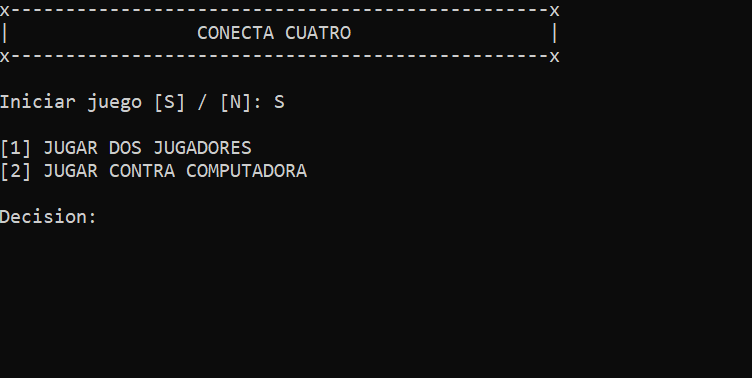
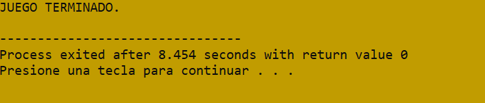
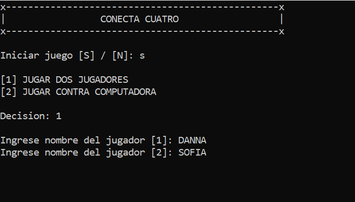
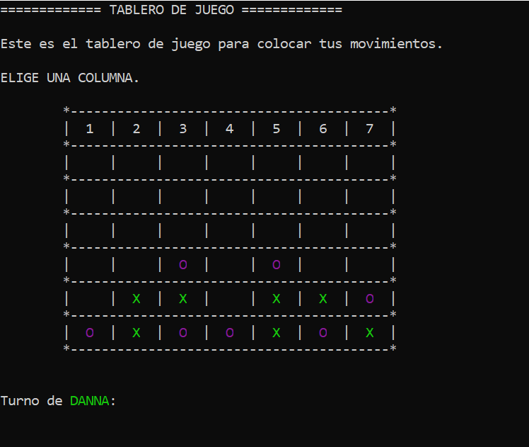
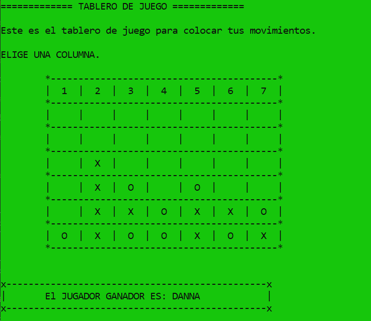
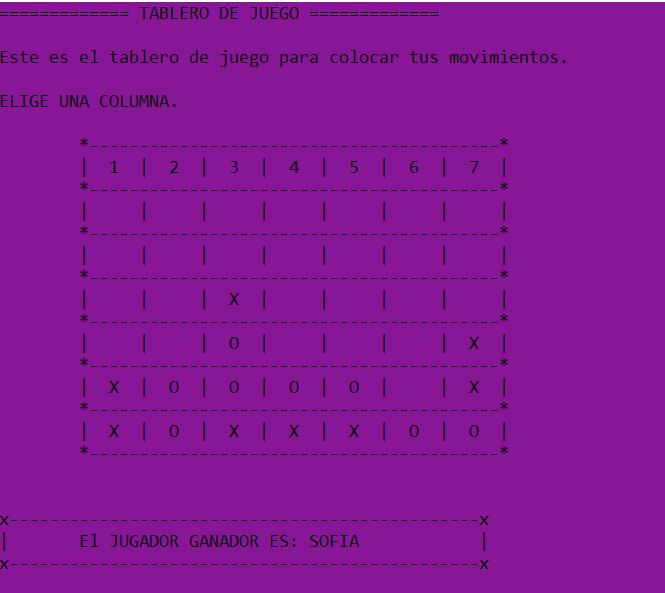
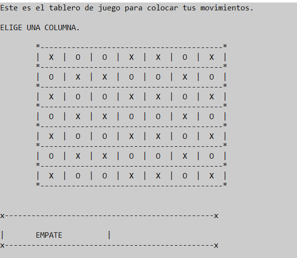
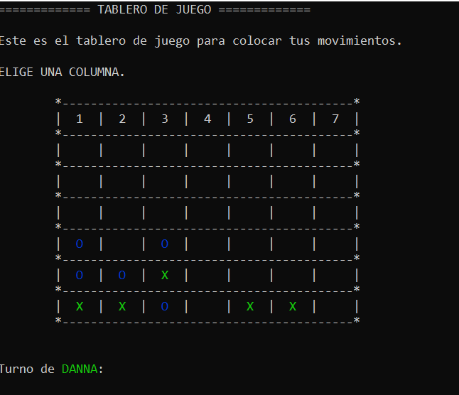
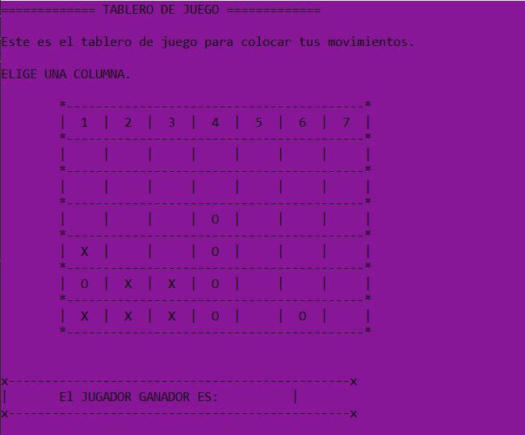

# ⭕❌ **CONNECT FOUR** ❌⭕

Connect-Four is a tic-tac-toe-like two-player game in which players alternately place pieces on a vertical board 7 columns across and 6 rows high. Each player uses pieces of a particular color (commonly black and red, or sometimes yellow and red, but in this application it is used 'X' and 'O'), and the object is to be the first to obtain four pieces in a horizontal, vertical, or diagonal line. Because the board is vertical, pieces inserted in a given column always drop to the lowest unoccupied row of that column. As soon as a column contains 6 pieces, it is full and no other piece can be placed in the column.

Both players begin with 21 identical pieces, and the first player to achieve a line of four connected pieces wins the game. If all 42 men are played and no player has places four pieces in a row, the game is drawn.

Although, this is a game for two players, this program includes an option to play against CPU too. So, feel free to design the best strategy to master this game. 
<br />
<br />

## ***CONTENT***
<nav>
<li><a href="#development">Development and considerations</a></li>
<li><a href="#flowchart">Flowchart</a></li>
<li><a href="#codeexecution">Code Execution</a></li>
<li><a href="#evidences">Evidences</a></li>
<li><a href="#conclusions">Conclusions</a></li>
</nav>
<br />
<br />

<a id="development"></a>
## ***DEVELOPMENT AND CONSIDERATIONS 💻***
<br />

The programming language used to develop this game is C++. If you want to add a new functionality just download this code and start to modify what you desire.

1. First download this repository


2. Go to "U4  " folder. The programm is called "connect-four-application.cpp"


3. All the program is based on functions. And in C++ the main function is called "main" where the application starts. Here you will find the calls to other functions. 


4. There are 7 functions, and each one carries out a specific task for the appropiate functionality of the game. It is recommended that if you want to add a new feature just create a new function to continue with this logic, however you can change the logic itself if it is neccesary to implement your new function.


<br />
<br />

### **INTELLIGENCE ALGORITHM**
<br />

It's important to mention that the algorithm developed to endow intelligence to CPU was designed to avoid the user wins. It doesn't try to create a path to get the victory. 

In addition to that, this algorithm doesn't block all the user moves due to the game was thought to implement: easy, medium and hard mode. And to begin we face an easy mode algorithm, which it is not perfect at all, however with the integration of the medium and hard mode algorithm, it is going to be more difficult to defeat CPU.
<br />
<br />
 

<br />
<br />

<a id="flowchart"></a>
## ***FLOWCHART 📊***
<br />

### **main Function Flowchart**


### **heading_game Function Flowchart**


### **validate_move Function Flowchart**


### **show_board Function Flowchart**


### **apply_move Function Flowchart**


### **computer_move Function Flowchart**


### **show_result Function Flowchart**

PART1


PART2


### **determine_winner Function Flowchart**


<a id="codeexecution"></a>
## ***CODE EXECUTION ▶⏸***
<br />

### **PREPROCESOR DIRECTIVES**
```
#include <iostream>
#include <windows.h>
#include <stdlib.h>
#include <time.h>
```

### **PROTOTYPE FUNCTIONS**
```
void heading_game();
void validate_move();
void show_board();
void apply_move();
void determine_winner();
void show_result();
int computer_move();
```

### **VARIABLE DECLARATIONS**
```
// BOARD
char board[7][7] = {
    {'1', '2', '3', '4', '5', '6', '7'},
    {' ', ' ', ' ', ' ', ' ', ' ', ' '},
    {' ', ' ', ' ', ' ', ' ', ' ', ' '},
    {' ', ' ', ' ', ' ', ' ', ' ', ' '},
    {' ', ' ', ' ', ' ', ' ', ' ', ' '},
    {' ', ' ', ' ', ' ', ' ', ' ', ' '},
    {' ', ' ', ' ', ' ', ' ', ' ', ' '},
};

// VARIABLES TO PLAY
char start;
char player1[20];
char player2[20];
int type_of_game;
int turn = 1;
char computer[] = "COMPUTADORA";
int move = 0;
int player_winner = 0;
bool winner = false;
```

### **MAIN FUNCTION**
```
int main () {
	
	srand(time(NULL));
	heading_game();
	
	cout<<"Iniciar juego [S] / [N]: ";
	cin>>start;
	
	if ( start == 'S' || start == 's' ) {
		
		cout<<"\n[1] JUGAR DOS JUGADORES";
		cout<<"\n[2] JUGAR CONTRA COMPUTADORA";
		cout<<"\n\nDecision: ";
		cin>>type_of_game;	
		
		if ( type_of_game == 1 ) { // JUGADOR1 VS JUGADOR2
			
			cout<<"\nIngrese nombre del jugador [1]: ";
			cin>>player1;
					
			cout<<"Ingrese nombre del jugador [2]: ";
			cin>>player2;
					
			do {
				validate_move();
				apply_move();	
				determine_winner();
				turn == 1 ? turn = 2 : turn = 1;
			} while( !winner );
			
		} else { // JUGADOR VS COMPUTADORA	
			cout<<"\nIngrese nombre de jugador: ";
			cin>>player1;
			
			do {		
					
				if ( turn == 1 ) 
					validate_move();					
				else 
					move = computer_move();
				
				apply_move();	
				determine_winner();				
				turn == 1 ? turn = 3 : turn = 1;
						
			} while( !winner );
		}
		
		show_result();	
		
	} else {
		system("cls");
		system("Color 60");
		cout<<"JUEGO TERMINADO."<<endl;
	}
		
	return 0;
}
```

### **HEADING_GAME FUNCTION**
```
void heading_game() {
	system("cls");
	
	for ( int i = 1; i <= 3; i++ ) {
		if ( i == 1 || i == 3 ) {
			for( int j = 0; j <= 50; j++ ) {
				if ( j == 0 || j == 50 ) {
					cout<<"x";
				} else {
					cout<<"-";	
				}
			}	
			
			cout<<endl;	
		} else {
			printf("|");
			printf("%31s", "CONECTA CUATRO" );
			printf("%20s", "|\n");
		}
	}
	
	cout<<"\n";
}
```

### **VALIDATE_MOVE FUNCTION**
```
void validate_move () {
	
	do {
		show_board();	
		
		if ( turn == 1 ) {
			cout<<"\nTurno de "<<"\033[1;32m"<<player1<<"\033[0m"<<": ";
		} else if ( turn == 2 ) {
			cout<<"\nTurno de "<<"\033[0;35m"<<player2<<"\033[0m"<<": ";
		} else {
			cout<<"\nTurno de "<<"\033[0;34m"<<computer<<"\033[0m"<<": ";
		}
		
		cin>>move;
		
	} while ( move < 1 || move > 7 || board[0][move - 1] == 'X' || board[0][move - 1] == 'O' );
						
}
```

### **SHOW_BOARD FUNCTION**
```
void show_board() {
	system("cls");
	cout<<"============= TABLERO DE JUEGO =============\n"<<endl;
	cout<<"Este es el tablero de juego para colocar tus movimientos.\n\n";
	cout<<"ELIGE UNA COLUMNA.\n\n";
	
	for( int i = 0; i <= 6; i++ ) {
		
		if ( i == 0 ) {
			cout<<"\t";
			for( int k = 1; k <= 43; k++ ) {
				if( k == 1 || k == 43 ) {
					cout<<"*";
				} else {
					cout<<"-";		
				}
			}
			cout<<"\n";
		}
		
		
		cout<<"\t";
		for ( int j = 0; j <= 6; j++ ) {
			if ( j == 0 ) {
				cout<<"|";
			}
					
			if ( board[i][j] == 'X' ) {
				cout<<"  "<<"\033[1;32m"<<board[i][j]<<"\033[0m"<<"  |";
			} else if ( board[i][j] == 'O' ) {
				
				if ( type_of_game == 1 ) {
					cout<<"  "<<"\033[0;35m"<<board[i][j]<<"\033[0m"<<"  |";
				} else {
					cout<<"  "<<"\033[0;34m"<<board[i][j]<<"\033[0m"<<"  |";	
				}
				
			} 
			else {
				cout<<"  "<<board[i][j]<<"  |";
			}				
		}
				
		cout<<"\n";
		cout<<"\t";
		for( int k = 1; k <= 43; k++ ) {
			if( k == 1 || k == 43 ) {
				cout<<"*";
			} else {
				cout<<"-";		
			}
		}
		cout<<"\n";
	}
			
	cout<<"\n";
}
```


### **APPLY_MOVE FUNCTION**
```
void apply_move() {
	
	cout<<move<<endl;
	cout<< board[0][move - 1]<<endl;
	system("pause");
	
	for ( int i = 6; i >= 0; i-- ) {
		if ( board[i][move - 1] != 'X' &&  board[i][move - 1] != 'O' ) {
			if ( turn == 1 ){
				board[i][move - 1] = 'X';
			} else {
				board[i][move - 1] = 'O';
			}
			
			break;
		}
	}
	
	show_board();
}
```

### **DETERMINE_WINNER FUNCTION**
```
void determine_winner() {
	
	// WINNER BY COLUMN
	for (int i = 0; i < 7; i++) {
        for (int j = 6; j >= 3; j--) {

          if (
            board[j][i] == 'X' ||
            board[j][i] == 'O'
          ) {
            if (
              board[j][i] == 'X' &&
              board[j-1][i] == 'X' &&
              board[j-2][i] == 'X' &&
              board[j-3][i] == 'X'
            ) {
              player_winner = 1;
              winner = true;
              break;
            }

            if (
              board[j][i] == 'O' &&
              board[j-1][i] == 'O' &&
              board[j-2][i] == 'O' &&
              board[j-3][i] == 'O'
            ) {
              player_winner = 2;
              winner = true;
              break;
            }
          } else {
            break;
          }
        }
    }	
    
	// WINNER BY ROW
    for (int j = 6; j >= 0; j--) {
        for (int i = 0; i <= 3; i++) {
          if (
            board[j][i] == 'X' &&
            board[j][i+1] == 'X' &&
            board[j][i+2] == 'X' &&
            board[j][i+3] == 'X'
          ) {
            player_winner = 1;
            winner = true;
            break;
          }

          if (
           	board[j][i] == 'O' &&
            board[j][i+1] == 'O' &&
            board[j][i+2] == 'O' &&
            board[j][i+3] == 'O'
          ) {
            player_winner = 2;
            winner = true;
            break;
          }
        }
    }
    
	// WINNER BY DIAGONALS
    for (int k = 7; k <= 13; k++) {
        
        int z = k - 6;
        
        if (k >= 10) z = 14 - k;

        // WINNER BY DIAGONAL LEFT-RIGHT
    	for (int i = 0; i < z; i++) {

          int x = 4 - (z - i);

	          if ( k < 11 ) {
	
	            if ( 
	              board[i][x] == 'X' &&
	              board[i + 1][x + 1] == 'X' &&
	              board[i + 2][x + 2] == 'X' &&
	              board[i + 3][x + 3] == 'X' 
	            ) {
	            	player_winner = 1;
		          	winner = true;
		            break;
	            }
	
	            if ( 
	              board[i][x] == 'O' &&
	              board[i + 1][x + 1] == 'O' &&
	              board[i + 2][x + 2] == 'O' &&
	              board[i + 3][x + 3] == 'O' 
	            ) {
	              	player_winner = 2;
		          	winner = true;
		            break;
	            }
	    	} else {
		            if ( 
		              board[x][i] == 'X' &&
		              board[x + 1][i + 1] == 'X' &&
		              board[x + 2][i + 2] == 'X' &&
		              board[x + 3][i + 3] == 'X' 
		            ) {
		              	player_winner = 1;
			          	winner = true;
			            break;
		            }
	
		            if ( 
		              board[x][i] == 'O' &&
		              board[x + 1][i + 1] == 'O' &&
		              board[x + 2][i + 2] == 'O' &&
		              board[x + 3][i + 3] == 'O' 
		            ) {
		              	player_winner = 2;
			          	winner = true;
			            break;
		            }
	     	}
		}
		
		 // WINNER BY DIAGONAL RIGHT-LEFT
        for( int i = 0; i < z; i++ ) {

          int x;

          if ( k < 11 ) {
            x = (z - i) + 2;

            if ( 
              board[x][i] == 'X' &&
              board[x - 1][i + 1] == 'X' &&
              board[x - 2][i + 2] == 'X' &&
              board[x - 3][i + 3] == 'X' 
            ) {
            	player_winner = 1;
			    winner = true;
				break;
            }

            if ( 
              board[x][i] == 'O' &&
              board[x - 1][i + 1] == 'O' &&
              board[x - 2][i + 2] == 'O' &&
              board[x - 3][i + 3] == 'O' 
            ) {
            	player_winner = 2;
			    winner = true;
				break;
            }
 
          } else {
            x = 6 - i;
            int y = 4 - (z - i);

            if ( 
              board[x][y] == 'X' &&
              board[x - 1][y + 1] == 'X' &&
              board[x - 2][y + 2] == 'X' &&
              board[x - 3][y + 3] == 'X' 
            ) {
        		player_winner = 1;
			    winner = true;
				break;
            }

            if ( 
              board[x][y] == 'O' &&
              board[x - 1][y + 1] == 'O' &&
              board[x - 2][y + 2] == 'O' &&
              board[x - 3][y + 3] == 'O' 
            ) {
            	player_winner = 2;
			    winner = true;
				break;
            }
          }
        }
		
	} // for diagonals
} // function
```

### **SHOW_RESULT FUNCTION**
```
void show_result() {
	
	cout<<"\n";
	
	for ( int i = 1; i <= 3; i++ ) {
		if ( i == 1 || i == 3 ) {
			for( int j = 0; j <= 48; j++ ) {
				if ( j == 0 || j == 48 ) {
					cout<<"x";
				} else {
					cout<<"-";	
				}
			}	
			
			cout<<endl;	
		} else {
			if ( player_winner == 0 ) {
				system("Color 70");
				cout<<"\n|\tEMPATE"<<"\t\t|"<<endl;
			} else if ( player_winner == 1 ) {
				system("Color A0");
				cout<<"|\tEl JUGADOR GANADOR ES: "<<player1<<"\t\t|"<<endl;	
			} else if ( player_winner == 2 ) {
				system("Color 50");
				cout<<"|\tEl JUGADOR GANADOR ES: "<<player2<<"\t\t|"<<endl;	
			} else {
				system("Color 50");
				cout<<"|\tEl JUGADOR GANADOR ES: "<<computer<<"\t\t|"<<endl;
			}		
		}
	}
	
	cout<<"\n";
}
```

### **COMPUTER_MOVE FUNCTION**
```
int computer_move() {

    for (int i = 0; i < 7; i++) {
	    if ( board[0][i] != 'X' && board[0][i] != 'O' ) {
	
	      for (int j = 6; j >= 3; j--) {
	
	        if (board[j][i] == 'X' || board[j][i] == 'O' ) {
	          if (
	            board[j][i] == 'X' &&
	            board[j-1][i] == 'X' &&
	            board[j-2][i] == 'X' &&
	            board[j-3][i] != 'O'
	          ) {
	            return i + 1;
	          }
	        } else {
	          break;
	        }
	      }
	    }
  	}
  	
  	for (int j = 0; j <= 6; j++) {
	    if ( board[0][j] != 'X' && board[0][j] != 'O' ) {
	      for (int i = 6; i >= 3; i--) {
	        if (
	          board[i][j] == 'X' &&
	          board[i][j+1] == 'X' &&
	          board[i][j+2] == 'X'
	        ) {
	          return j + 4;
	        }
	      }
	    }
  	}
  	
  	int random;
  	
  	do {
		random = 1 + rand() % (6);
	} while( board[0][random - 1] == 'X' || board[0][random - 1] == 'O' );
  
  	return random;
}
```

### **MAIN FUNCTION EXECUTION**

1. The application starts in this function.

2. Apply feed to generate random numbers.

3. Show heading game calling the function heading_game.

4. Ask the user to start the game. 

5. If the Answer is "SI". Start the game. If the answer is "NO", go to step 6.
  * 5.1 If the answer is 1, start game with two players. <br />

    * 5.1.1 Ask for the name of the player 1.

    * 5.1.2 Ask for the name of the player 2.

    * 5.1.3 While there is no winner.
      
      * 5.1.3.1 The user is going to enter his/her movement and it's going to pass through the function validate_move which is going to show the board of the game and it will validate the input of the user. 

      * 5.1.3.2 Once the program accepts the input, it applies the move into the board.

      * 5.1.3.3 Call the function determine_winner to evaluate if there is winner at this moment in the game and add one to the variable quantity_move

      * 5.1.3.4 Switch the turn of the player.   

  * 5.2 If the answer is 2, start game against computer.

    * 5.2.1 Ask for the name of the player 1.

    * 5.2.2 While there is no winner.

      * 5.2.2.1 if the turn is equal to 1. The user is going to enter his/her movement and it's going to pass through the function validate_move which is going to show the board of the game and it will validate the input of the user. 

      * 5.2.2.2 if the turn is equal to 2. The computer is going to generate a movement depending the state of the board at the moment and return that value to move variable.

      * 5.2.2.3 Once the program accepts the input, it applies the move into the board.

      * 5.2.2.4 Call the function determine_winner to evaluate if there is winner at this moment in the game and add one to the variable quantity_move.

      * 5.2.2.5 Switch the turn between the player and the computer.
  
    * 5.2.3 Show the result calling the function show_result
	
* 5.3. Show the result of the game calling the function that carries out that task.

6. End of the program.
<br />
<br />

<a id="evidences"></a>
## ***EVIDENCES 📷***
<br />

1. START THE GAME ( THE USER WANTS TO PLAY )
<br />


2. START THE GAME ( THE USER DOES NOT WANT TO PLAY )
<br />


3. GAME MODE 1: PLAYER1 VS PLAYER 2 🤵
<br />


4. PLAYING PLAYER 1 VS PLAYER 2🤵
<br />


5. PLAYER 1 WINS 🟢
<br />


6. PLAYER 2 WINS 🔴
<br />


7. DRAW ✖
<br />


8. PLAYING WITH COMPUTER 🖥💻

<br />

9. COMPUTER WINS 🖥💻
<br />

<br />
<br />