# ⭕❌ **CONNECT FOUR** ❌⭕

Connect-Four is a tic-tac-toe-like two-player game in which players alternately place pieces on a vertical board 7 columns across and 6 rows high. Each player uses pieces of a particular color (commonly black and red, or sometimes yellow and red, but in this application it is used 'X' and 'O'), and the object is to be the first to obtain four pieces in a horizontal, vertical, or diagonal line. Because the board is vertical, pieces inserted in a given column always drop to the lowest unoccupied row of that column. As soon as a column contains 6 pieces, it is full and no other piece can be placed in the column.

Both players begin with 21 identical pieces, and the first player to achieve a line of four connected pieces wins the game. If all 42 men are played and no player has places four pieces in a row, the game is drawn.

Although, this is a game for two players, this program includes an option to play against CPU too. So, feel free to design the best strategy to master this game. 
 
 

## ***CONTENT***
<nav>
<li><a href="#development">Development and considerations</a></li>
<li><a href="#flowchart">Flowchart</a></li>
<li><a href="#codeexecution">Code Execution</a></li>
<li><a href="#evidences">Evidences</a></li>
<li><a href="#conclusions">Conclusions</a></li>
</nav>
 
 

## ***DEVELOPMENT AND CONSIDERATIONS 💻***
 

The programming language used to develop this game is C++. If you want to add a new functionality just download this code and start to modify what you desire.

1. First download this repository

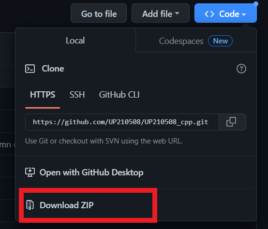

2. Go to "U4  " folder. The programm is called "connect-four-application.cpp"

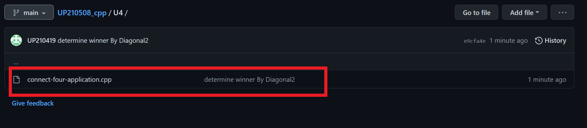

3. All the program is based on functions. And in C++ the main function is called "main" where the application starts. Here you will find the calls to other functions. 

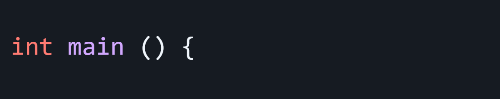

4. There are 7 functions, and each one carries out a specific task for the appropiate functionality of the game. It is recommended that if you want to add a new feature just create a new function to continue with this logic, however you can change the logic itself if it is neccesary to implement your new function.

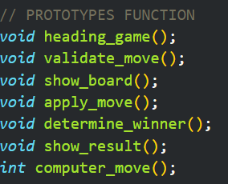
 
 

### **INTELLIGENCE ALGORITHM**
 

It's important to mention that the algorithm developed to endow intelligence to CPU was designed to avoid the user wins. It doesn't try to create a path to get the victory. 

In addition to that, this algorithm doesn't block all the user moves due to the game was thought to implement: easy, medium and hard mode. And to begin we face an easy mode algorithm, which it is not perfect at all, however with the integration of the medium and hard mode algorithm, it is going to be more difficult to defeat CPU.
 
 
 
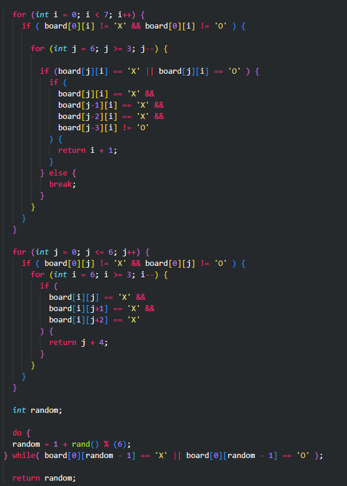
 
 

## ***FLOWCHART 📊***
 

### **main Function Flowchart**

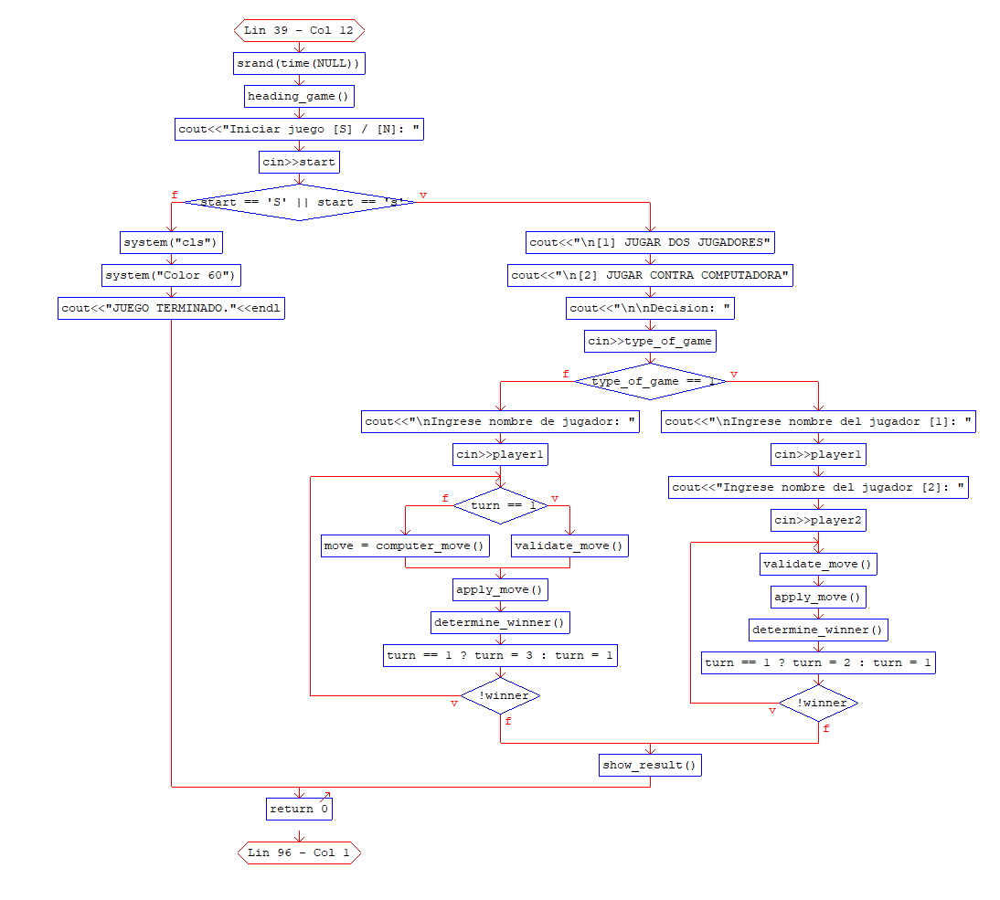

### **heading_game Function Flowchart**

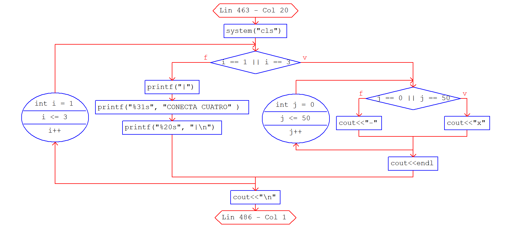

### **validate_move Function Flowchart**

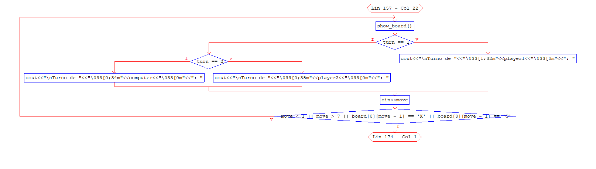

### **show_board Function Flowchart**

### **apply_move Function Flowchart**

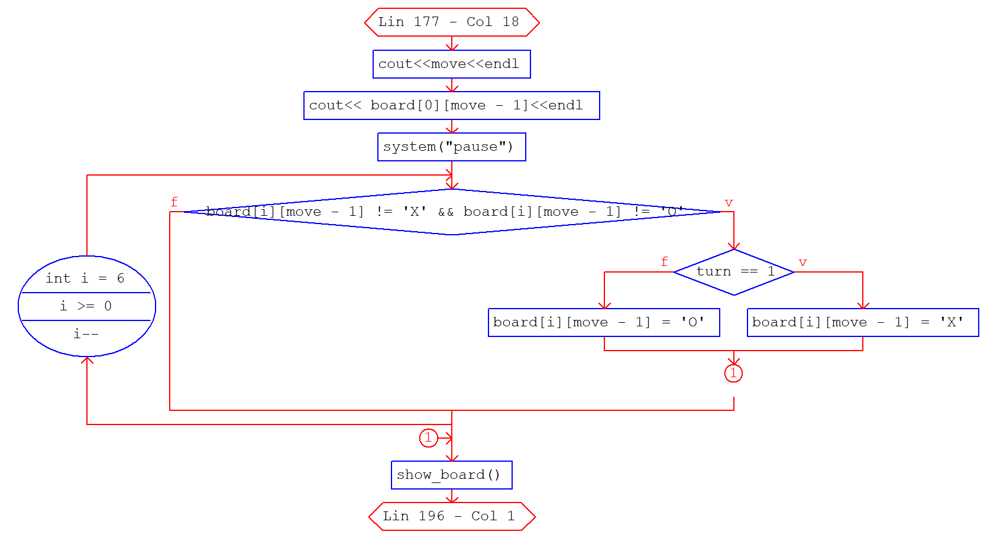

### **computer_move Function Flowchart**

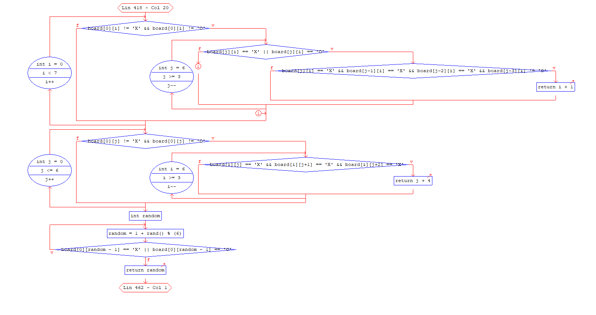

### **show_result Function Flowchart**

PART1
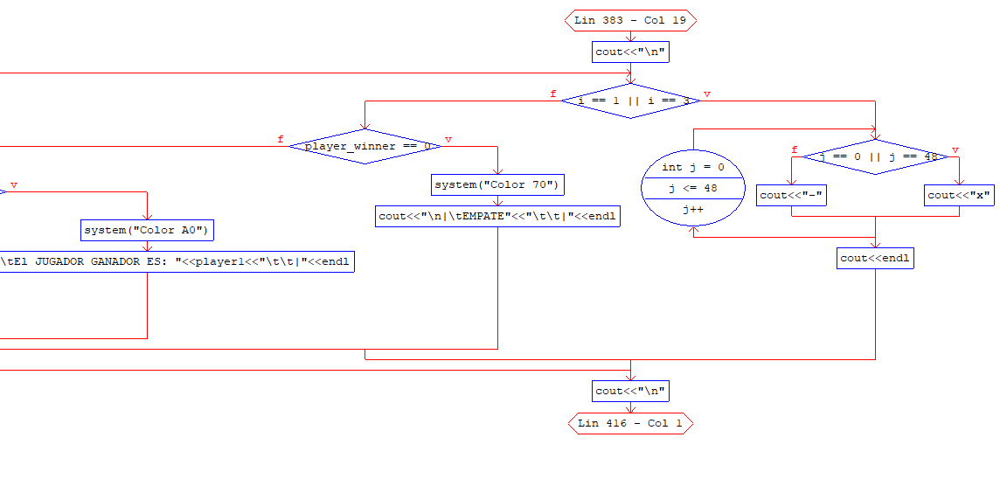

PART2
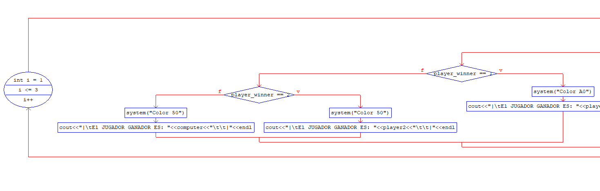

### **determine_winner Function Flowchart**
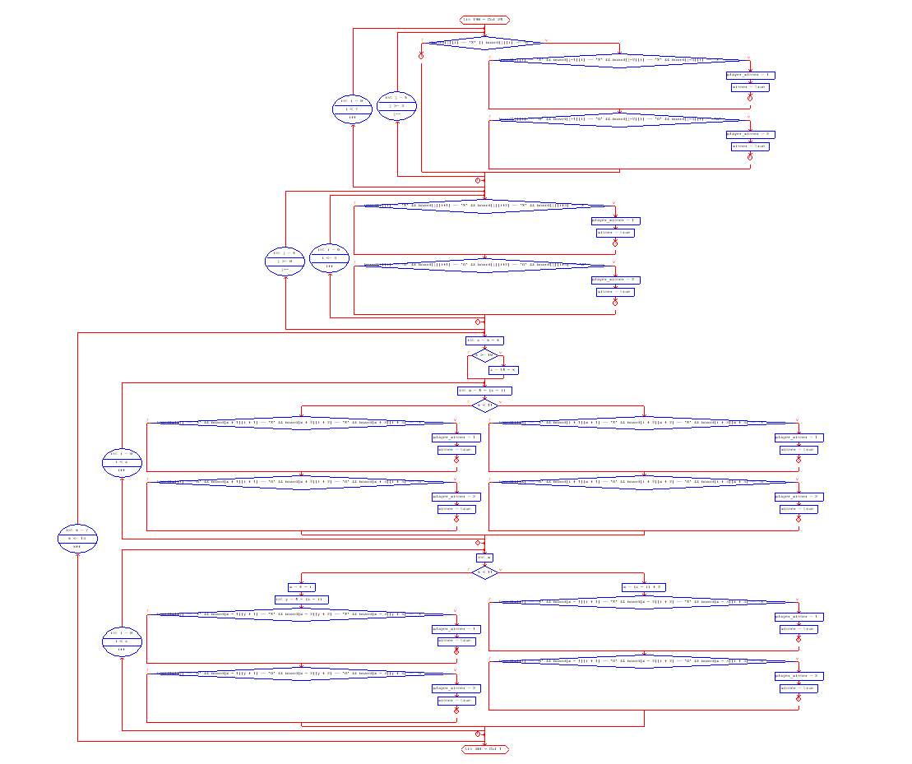